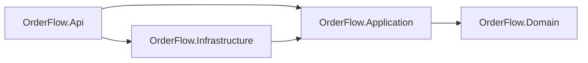
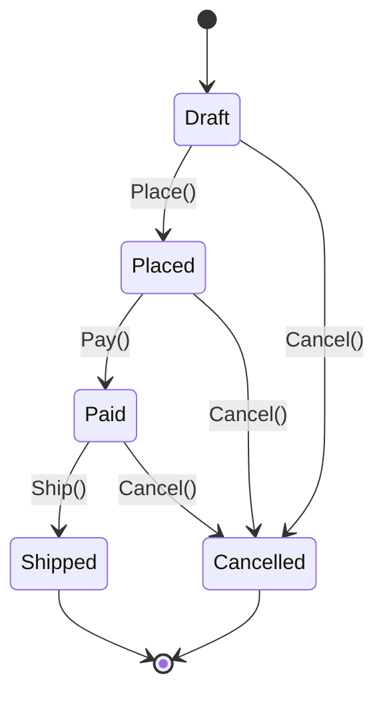

# OrderFlow


Order management API built with **.NET 10**, **EF Core** and **Clean Architecture**, with a rich domain model and unit tests.

The goal of this project is to demonstrate how to keep business rules isolated in the domain, independent of frameworks and infrastructure, and fully covered by fast unit tests.

## Tech stack

| Concern         | Technology                                  |
| --------------- | ------------------------------------------- |
| Runtime         | .NET 10 / C#                                |
| API             | ASP.NET Core (controllers)                  |
| Persistence     | EF Core 10 + PostgreSQL (Npgsql)            |
| Testing         | xUnit, NSubstitute, Shouldly, FakeTimeProvider |
| Local infra     | Docker Compose                              |

## Architecture

The solution follows Clean Architecture: dependencies always point inward, toward the domain.



| Project                  | Responsibility                                                                 |
| ------------------------ | ------------------------------------------------------------------------------ |
| `OrderFlow.Domain`       | Entities, value objects and business rules. No external dependencies.          |
| `OrderFlow.Application`  | Use cases (handlers) and abstractions such as `IOrderRepository` and `IUnitOfWork`. |
| `OrderFlow.Infrastructure` | EF Core `DbContext`, mappings, migrations and repository implementations.    |
| `OrderFlow.Api`          | HTTP endpoints, dependency injection and configuration.                        |

### Project structure

```
OrderFlow
├── src
│   ├── OrderFlow.Domain
│   │   ├── Common            # Entity base class, DomainException
│   │   ├── Orders            # Order aggregate, OrderItem, OrderStatus
│   │   └── ValueObjects      # Money
│   ├── OrderFlow.Application
│   │   ├── Abstractions      # IOrderRepository, IUnitOfWork
│   │   ├── Common            # NotFoundException
│   │   └── Orders            # CreateOrder, PlaceOrder use cases
│   ├── OrderFlow.Infrastructure
│   │   └── Persistence       # DbContext, configurations, repositories, migrations
│   └── OrderFlow.Api
├── tests
│   ├── OrderFlow.Domain.Tests
│   └── OrderFlow.Application.Tests
├── docker-compose.yml
└── Directory.Build.props
```

## Domain

`Order` is the aggregate root. All changes to its items go through it, so its invariants are always enforced.

### Order lifecycle



### Business rules

- An order must belong to a customer.
- Items can only be added or removed while the order is a **Draft**.
- Adding the same product twice merges the quantities.
- Quantity must be greater than zero.
- An order cannot be placed without items.
- A **Shipped** order cannot be cancelled.
- `Money` cannot be negative and is always rounded to two decimal places.

### Design decisions

- **Encapsulated aggregate**: private setters and a private `_items` list, exposed as `IReadOnlyCollection`. EF Core maps the backing field directly.
- **`Money` as a value object**: mapped by EF Core as a complex type, stored as a `unit_price` column without its own table or key.
- **Time-independent domain**: the domain never calls `DateTime.Now`. The creation date is passed in and comes from `TimeProvider` in the Application layer, which makes tests deterministic.
- **Client-generated IDs**: `Guid.CreateVersion7()` produces time-ordered IDs, which are index-friendly.
- **No MediatR**: use cases are plain handler classes registered in DI, keeping the flow explicit and easy to follow.

## Getting started

### Prerequisites

- [.NET 10 SDK](https://dotnet.microsoft.com/download)
- [Docker](https://www.docker.com/)
- EF Core CLI: `dotnet tool install --global dotnet-ef`

### Running locally

```bash
# 1. Start PostgreSQL
docker compose up -d

# 2. Apply migrations
dotnet ef database update -p src/OrderFlow.Infrastructure -s src/OrderFlow.Api

# 3. Run the API
dotnet run --project src/OrderFlow.Api
```

The default connection string is in `src/OrderFlow.Api/appsettings.Development.json` and matches the Docker Compose setup.

## Running tests

```bash
dotnet test
```

- **Domain tests** cover the order lifecycle, item rules and `Money` behavior.
- **Application tests** cover the use cases, using NSubstitute for repository and unit-of-work mocks and `FakeTimeProvider` for time.

## Roadmap

- [x] Domain model with business rules
- [x] Application use cases (create and place order)
- [x] EF Core persistence with PostgreSQL
- [x] REST endpoints with global error handling (`ProblemDetails`)
- [x] API documentation with Scalar
- [ ] Remaining use cases (pay, ship, cancel, get order)
- [ ] Integration tests with Testcontainers
- [ ] CI pipeline with GitHub Actions

## Conventions

This repository follows [Conventional Commits](https://www.conventionalcommits.org/) (`feat`, `fix`, `test`, `refactor`, `chore`, `docs`), and each layer was delivered through its own pull request.